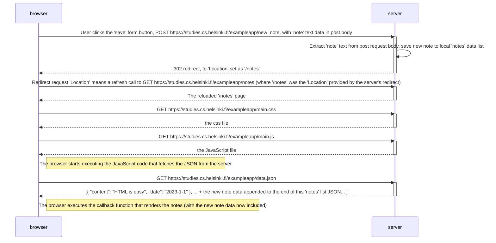

```mermaid
sequenceDiagram
    participant browser
    participant server

    browser->>server: User clicks the 'save' form button, POST https://studies.cs.helsinki.fi/exampleapp/new_note, with 'note' text data in post body
    activate server
    server->>server: Extract 'note' text from post request body, save new note to local 'notes' data list
    server-->>browser: 302 redirect, to 'Location' set as '/notes'
    deactivate server

    browser->>server: Redirect request 'Location' means a refresh call to GET https://studies.cs.helsinki.fi/exampleapp/notes (where '/notes' was the 'Location' provided by the server's redirect)
    activate server
    server-->>browser: The reloaded '/notes' page
    deactivate server

    browser->>server: GET https://studies.cs.helsinki.fi/exampleapp/main.css
    activate server
    server-->>browser: the css file
    deactivate server

    browser->>server: GET https://studies.cs.helsinki.fi/exampleapp/main.js
    activate server
    server-->>browser: the JavaScript file
    deactivate server

    Note right of browser: The browser starts executing the JavaScript code that fetches the JSON from the server

    browser->>server: GET https://studies.cs.helsinki.fi/exampleapp/data.json
    activate server
    server-->>browser: [{ "content": "HTML is easy", "date": "2023-1-1" }, ... + the new note data appended to the end of this 'notes' list JSON... ]
    deactivate server

    Note right of browser: The browser executes the callback function that renders the notes (with the new note data now included)
```
