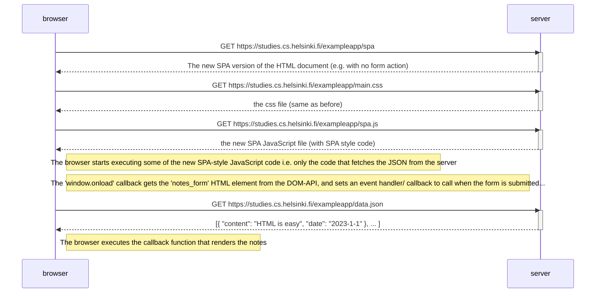

```mermaid
sequenceDiagram
    participant browser
    participant server

    browser->>server: GET https://studies.cs.helsinki.fi/exampleapp/spa
    activate server
    server-->>browser: The new SPA version of the HTML document (e.g. with no form action)
    deactivate server

    browser->>server: GET https://studies.cs.helsinki.fi/exampleapp/main.css
    activate server
    server-->>browser: the css file (same as before)
    deactivate server

    browser->>server: GET https://studies.cs.helsinki.fi/exampleapp/spa.js
    activate server
    server-->>browser: the new SPA JavaScript file (with SPA style code)
    deactivate server

    Note right of browser: The browser starts executing some of the new SPA-style JavaScript code i.e. only the code that fetches the JSON from the server
    Note right of browser: The 'window.onload' callback gets the 'notes_form' HTML element from the DOM-API, and sets an event handler/ callback to call when the form is submitted...

    browser->>server: GET https://studies.cs.helsinki.fi/exampleapp/data.json
    activate server
    server-->>browser: [{ "content": "HTML is easy", "date": "2023-1-1" }, ... ]
    deactivate server

    Note right of browser: The browser executes the callback function that renders the notes
```
