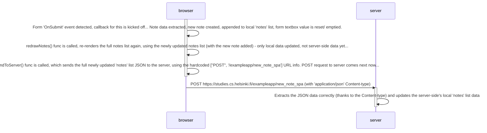

```mermaid
sequenceDiagram
    participant browser
    participant server

    activate browser
    browser->>browser: Form 'OnSubmit' event detected, callback for this is kicked off... Note data extracted, new note created, appended to local 'notes' list, form textbox value is reset/ emptied.
    browser->>browser: redrawNotes() func is called, re-renders the full notes list again, using the newly updated notes list (with the new note added) - only local data updated, not server-side data yet...
    browser->>browser: sendToServer() func is called, which sends the full newly updated 'notes' list JSON to the server, using the hardcoded ["POST", '/exampleapp/new_note_spa'] URL info. POST request to server comes next now...
    deactivate browser
    browser->>server: POST https://studies.cs.helsinki.fi/exampleapp/new_note_spa (with 'application/json' Content-type)
    activate server
    server->>server: Extracts the JSON data correctly (thanks to the Content-type) and updates the server-side's local 'notes' list data
    deactivate server
```
